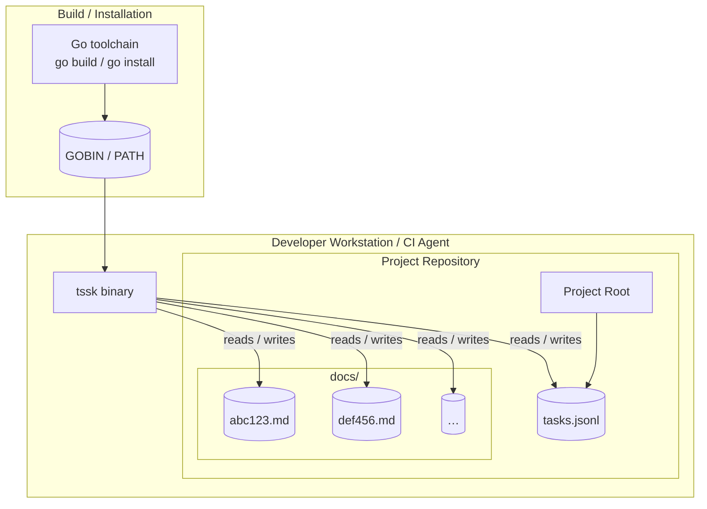

# Deployment Architecture

## Purpose
This diagram illustrates the typical deployment model for `tssk`. Because `tssk` is a local CLI tool that operates on the file system, "deployment" refers to the environment in which it runs – a developer workstation or a CI/CD agent.

## Diagram

## Key Components
- **tssk binary**: The compiled Go executable placed on the system `PATH`.
- **Project Root**: The working directory (or `TSSK_ROOT` if set) where `tasks.jsonl` lives.
- **tasks.jsonl**: Single JSONL file holding all task metadata.
- **docs/**: Sub-directory containing one markdown file per task, named by the SHA-256 content-address hash.
- **Go toolchain**: Used to build the binary from source (`go build ./...` or `go install`).

## Notes
- No server, database, or network service is required.
- Multiple users can share tasks by committing `tasks.jsonl` and `docs/` to version control.
- The `TSSK_ROOT` environment variable can redirect storage to any directory (useful in CI scripts).

## Related Diagrams
- [System Overview](system-overview.md)
- [Data Persistence Pipeline](../flows/data-pipeline.md)
