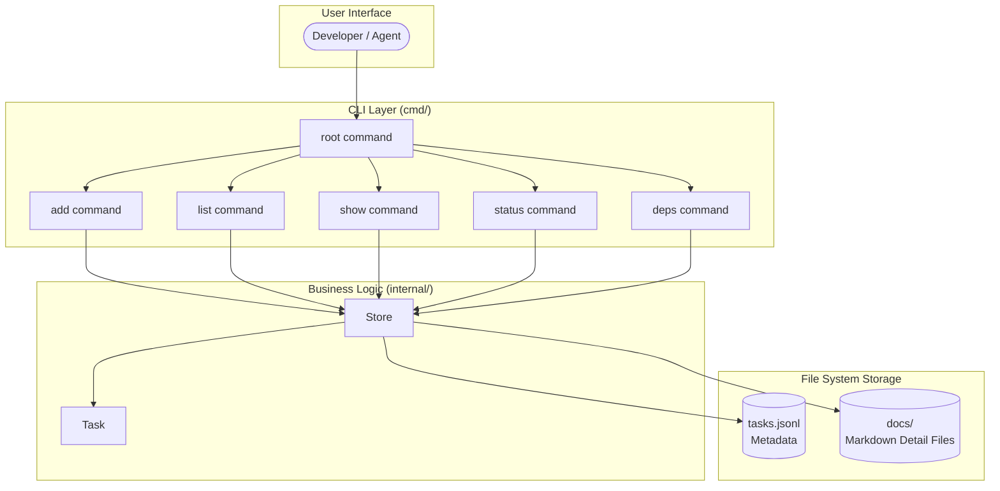

# System Architecture Overview

## Purpose
This diagram shows the high-level architecture of `tssk`, a command-line tool for managing repository tasks. It illustrates the relationships between the CLI layer, the internal business logic, and the file-system storage backend.

## Diagram

## Key Components
- **CLI Layer (`cmd/`)**: Cobra-based commands that parse user input and delegate to the Store.
- **Store (`internal/store`)**: Manages persistence – reads/writes the JSONL metadata file and the content-addressed markdown detail files.
- **Task (`internal/task`)**: Defines the `Task` struct, `Status` type, and helper methods for dependency management and content-address hashing.
- **tasks.jsonl**: Newline-delimited JSON file containing task metadata (one task per line).
- **docs/**: Directory holding content-addressed markdown files (named by SHA-256 hash of task metadata).

## Notes
- The tool is designed for single-user, file-system-based operation – no network or database dependency.
- `TSSK_ROOT` environment variable overrides the working directory used for storage.

## Related Diagrams
- [Module Dependencies](../components/dependencies.md)
- [CLI Command Flow](../sequences/cli-command-flow.md)
- [Task State Machine](../flows/task-states.md)
