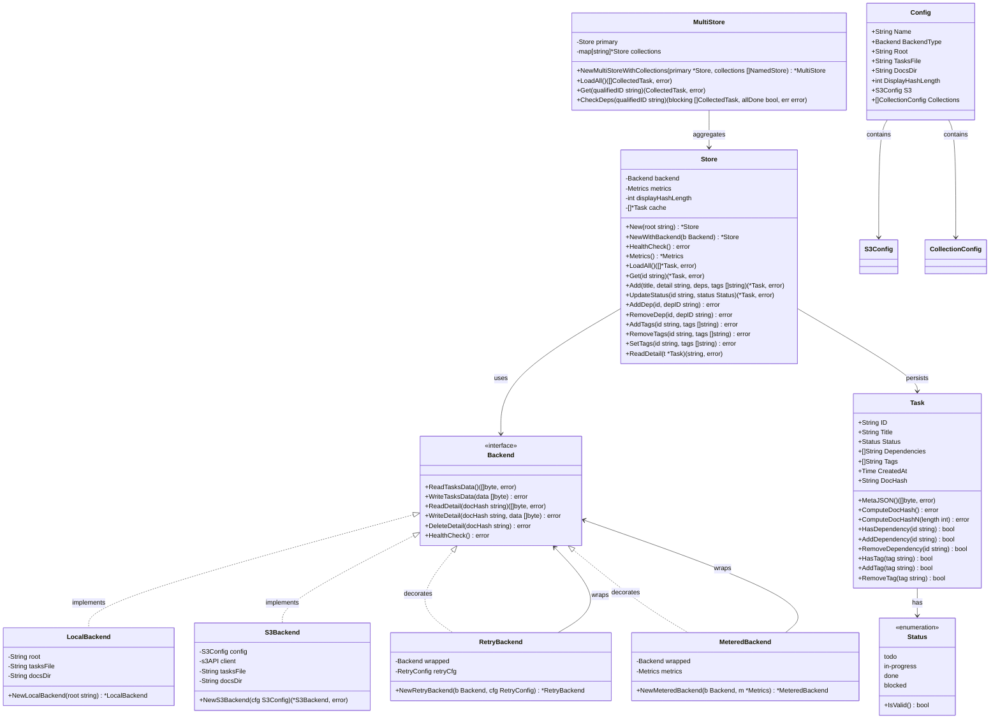

# Class / Type Diagram

## Purpose
This diagram shows the Go types defined in the `internal/task` and `internal/store` packages, their fields, and the relationships between them.

## Diagram

## Key Components
- **Task**: Central data model representing a single work item. Holds metadata including tags and the SHA-256 `DocHash` that links to its markdown detail file.
- **Status**: Enumeration type constraining the lifecycle of a task (`todo`, `in-progress`, `done`, `blocked`).
- **Backend**: Interface defining low-level storage operations. Implemented by `LocalBackend` (filesystem) and `S3Backend` (S3-compatible object storage).
- **RetryBackend**: Decorator that wraps any Backend with exponential backoff retry logic (3 attempts, configurable).
- **MeteredBackend**: Decorator that collects metrics (operation counts, errors, timing) on all backend calls.
- **Store**: High-level persistence manager. Created via `New(root)` or `NewWithBackend(backend)`. Manages task CRUD, dependencies, tags, and caching.
- **MultiStore**: Aggregates a primary Store with named collection Stores for cross-project task management using qualified IDs (`{collection}:{id}`).
- **Config**: Configuration loaded from `.tssk.json` with environment variable overrides.

## Notes
- `DocHash` is computed from the immutable fields (`ID`, `Title`, `CreatedAt`) using SHA-256, making it a stable content address.
- The Store caches loaded tasks in memory after the first `LoadAll()` call.
- Task IDs are sequential integers as strings (`"1"`, `"2"`, …) generated at creation time.
- The backend decorator chain is: `MeteredBackend` → `RetryBackend` → `LocalBackend/S3Backend`.
- `displayHashLength` (default 9) controls the filename prefix length for detail markdown files; the full 64-char hash is stored in `DocHash`.

## Related Diagrams
- [Module Dependencies](dependencies.md)
- [Task State Machine](../flows/task-states.md)
