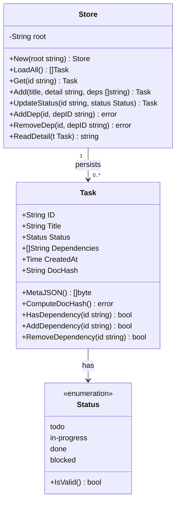

# Class / Type Diagram

## Purpose
This diagram shows the Go types defined in the `internal/task` and `internal/store` packages, their fields, and the relationships between them.

## Diagram

## Key Components
- **Task**: Central data model representing a single work item. Holds metadata and the SHA-256 `DocHash` that links to its markdown detail file.
- **Status**: Enumeration type constraining the lifecycle of a task (`todo`, `in-progress`, `done`, `blocked`).
- **Store**: Persistence layer responsible for reading and writing task metadata (JSONL) and detail files (Markdown). Created via `store.New(root)`.

## Notes
- `DocHash` is computed from the immutable fields (`ID`, `Title`, `CreatedAt`) using SHA-256, making it a stable content address.
- The `Store` does not cache in memory; every operation re-reads the JSONL file to avoid stale state.
- Task IDs are sequential strings (`T-1`, `T-2`, …) generated at creation time.

## Related Diagrams
- [Module Dependencies](dependencies.md)
- [Task State Machine](../flows/task-states.md)
