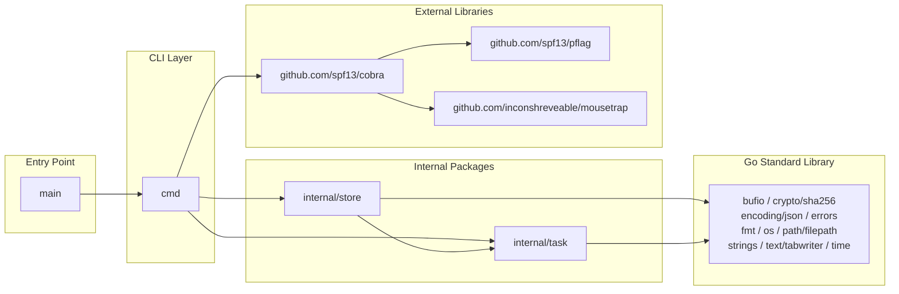

# Module Dependencies

## Purpose
This diagram shows the dependency relationships between the Go packages that make up `tssk`, including the external library dependency on Cobra.

## Diagram

## Key Components
- **main**: Minimal entry point – calls `cmd.Execute()`.
- **cmd**: All Cobra command definitions (`add`, `list`, `show`, `status`, `deps`). Depends on `store` and `task` for business logic.
- **internal/store**: Persistence layer; depends on `internal/task` for the `Task` type.
- **internal/task**: Pure domain logic with no external dependencies beyond the Go standard library.
- **github.com/spf13/cobra**: CLI framework used for command routing and flag parsing.

## Notes
- `internal/task` has no dependency on `internal/store`, keeping domain logic cleanly separated.
- Both `pflag` and `mousetrap` are indirect dependencies pulled in by Cobra.

## Related Diagrams
- [System Overview](../architecture/system-overview.md)
- [Class Diagram](class-diagram.md)
