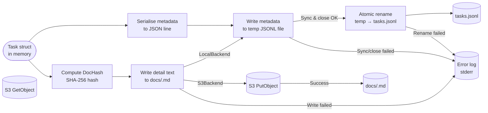

# Data Persistence Pipeline

## Purpose
This diagram shows how task data flows through the persistence layer – from the in-memory `Task` struct to backend-dependent storage targets via the pluggable Backend interface. With the local backend, the default targets are `.tsks/tasks.jsonl` and content-addressed markdown files under `.tsks/docs/`; with the S3 backend, the same metadata and detail content are stored as objects instead of on-disk files.

## Diagram

## Key Components
- **Task struct**: The in-memory representation of a task produced by `store.Add` or loaded via `store.LoadAll`.
- **DocHash**: Computed once at creation time from immutable fields (`id`, `title`, `created_at`); used as the content address for the markdown detail file.
- **Temp JSONL file**: Written in the same directory as `tasks.jsonl` to ensure the `rename` is atomic on the same filesystem (local backend only).
- **tasks.jsonl**: The primary metadata store – one JSON object per line.
- **docs/<hash_prefix>.md**: The human-readable detail document for a task, named by a configurable hash prefix (default 9 chars from the 64-char SHA-256).
- **Backend interface**: Abstracts storage operations. `LocalBackend` uses filesystem atomic writes; `S3Backend` uses S3 PutObject/GetObject.

## Notes
- Reading tasks follows the reverse path: parse each line of `tasks.jsonl` into a `Task` struct, then optionally read the detail from `docs/<hash_prefix>.md` (or S3 bucket).
- The atomic rename pattern (`WriteFile` → temp → `os.Rename`) ensures that a crash mid-write does not corrupt the existing JSONL file. This pattern is only available with the local backend.
- S3 backend does not support atomic rename; concurrent writes may result in last-write-wins semantics.
- The Backend is decorated with `RetryBackend` (exponential backoff) and `MeteredBackend` (metrics collection).

## Related Diagrams
- [System Overview](../architecture/system-overview.md)
- [Task Creation Flow](task-creation.md)
- [Deployment Architecture](../architecture/deployment.md)
