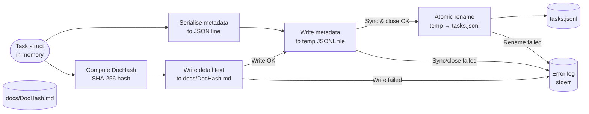

# Data Persistence Pipeline

## Purpose
This diagram shows how task data flows through the persistence layer – from the in-memory `Task` struct to the two on-disk storage targets (`tasks.jsonl` and the content-addressed markdown file in `docs/`).

## Diagram

## Key Components
- **Task struct**: The in-memory representation of a task produced by `store.Add` or loaded via `store.LoadAll`.
- **DocHash**: Computed once at creation time; used as the filename for the markdown detail file, providing stable content addressing.
- **Temp JSONL file**: Written in the same directory as `tasks.jsonl` to ensure the `rename` is atomic on the same filesystem.
- **tasks.jsonl**: The primary metadata store – one JSON object per line.
- **docs/DocHash.md**: The human-readable detail document for a task.

## Notes
- Reading tasks follows the reverse path: parse each line of `tasks.jsonl` into a `Task` struct, then optionally read the detail from `docs/DocHash.md`.
- The atomic rename pattern (`WriteFile` → temp → `os.Rename`) ensures that a crash mid-write does not corrupt the existing JSONL file.

## Related Diagrams
- [System Overview](../architecture/system-overview.md)
- [Task Creation Flow](task-creation.md)
- [Deployment Architecture](../architecture/deployment.md)
