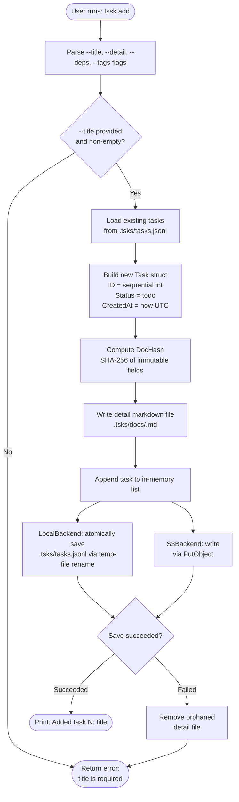

# Task Creation Flow

## Purpose
This diagram illustrates the end-to-end flow when a user runs `tssk add --title "..." --detail "..." --deps 1,2 --tags bug,urgent` to create a new task.

## Diagram

## Key Components
- **Flag parsing**: Cobra validates that `--title` is present and non-empty before delegating to the Store.
- **DocHash**: SHA-256 of the JSON-encoded immutable metadata (`id`, `title`, `created_at`) – serves as a stable content address for the detail file.
- **Atomic save (LocalBackend)**: The JSONL file is replaced atomically using a temp-file rename to prevent partial writes. This pattern is only available with the local backend.
- **S3 write (S3Backend)**: The JSONL content is uploaded via a single PutObject call; no atomic rename is involved.
- **Orphan cleanup**: If the JSONL save fails after the detail file is written, the orphaned detail file is removed as a best-effort cleanup.

## Notes
- Task IDs are sequential integers as strings (`"1"`, `"2"`, …) based on the current count of tasks.
- Dependencies (`--deps`) are stored as a list of task ID strings; they are not validated against existing tasks at creation time.
- The detail filename uses a configurable hash prefix length (default 9 characters from the full 64-char SHA-256 hash).
- Tags (`--tags`) are provided as a comma-separated CLI input and stored on the task as a JSON array of strings.

## Related Diagrams
- [Task State Machine](task-states.md)
- [CLI Command Flow](../sequences/cli-command-flow.md)
- [Data Persistence Pipeline](data-pipeline.md)
