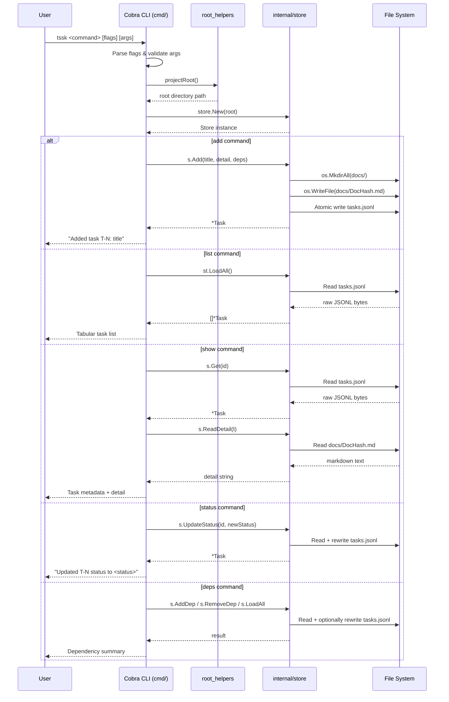

# CLI Command Flow

## Purpose
This diagram illustrates the sequence of interactions between the user, the Cobra CLI layer, and the internal `Store` when a typical `tssk` command is executed.

## Diagram

## Key Components
- **User**: Developer or automation agent invoking `tssk` from the terminal.
- **Cobra CLI (`cmd/`)**: Parses flags, validates arguments, and routes to the correct `RunE` handler.
- **root_helpers**: Provides `projectRoot()`, which reads `TSSK_ROOT` or falls back to the current working directory.
- **Store (`internal/store`)**: Stateless persistence layer; every command creates a fresh `Store` instance.
- **File System**: The only storage backend – `tasks.jsonl` and `docs/*.md`.

## Notes
- Every command creates a new `Store` instance (no shared state between invocations).
- Errors at any step are printed to stderr and result in a non-zero exit code via Cobra's `RunE` mechanism.

## Related Diagrams
- [System Overview](../architecture/system-overview.md)
- [Task Creation Flow](../flows/task-creation.md)
- [Error Handling Flow](error-handling.md)
