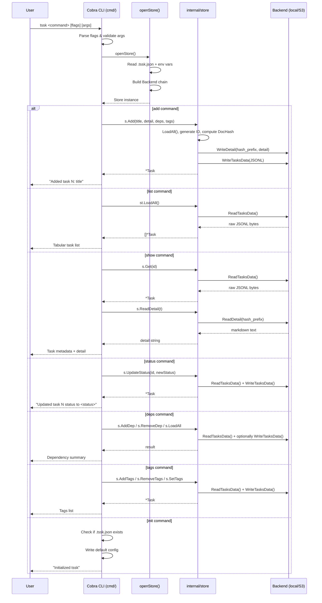

# CLI Command Flow

## Purpose
This diagram illustrates the sequence of interactions between the user, the Cobra CLI layer, and the internal `Store` when a typical `tssk` command is executed.

## Diagram

## Key Components
- **User**: Developer or automation agent invoking `tssk` from the terminal.
- **Cobra CLI (`cmd/`)**: Parses flags, validates arguments, and routes to the correct `RunE` handler.
- **openStore()**: Reads `.tssk.json` + env vars, builds the Backend chain (metrics → retry → base), returns a Store.
- **Store (`internal/store`)**: High-level persistence manager; every command creates a fresh instance via `openStore()`.
- **Backend**: Pluggable storage interface. `LocalBackend` uses filesystem; `S3Backend` uses S3-compatible object storage. Both are decorated with `RetryBackend` and `MeteredBackend`.

## Notes
- Every command creates a new Store instance (no shared state between invocations).
- Errors at any step are printed to stderr and result in a non-zero exit code via Cobra's `RunE` mechanism.
- The `MultiStore` variant enables cross-project task management with qualified IDs (`{collection}:{id}`).

## Related Diagrams
- [System Overview](../architecture/system-overview.md)
- [Task Creation Flow](../flows/task-creation.md)
- [Error Handling Flow](error-handling.md)
