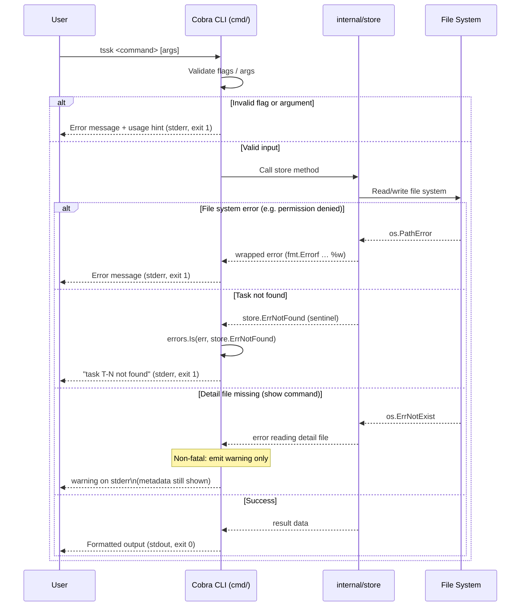

# Error Handling Flow

## Purpose
This diagram shows how errors are propagated and surfaced in `tssk`, from detection in the storage layer up through the Cobra CLI to the user.

## Diagram

## Key Components
- **Cobra CLI**: First line of defence – rejects missing required flags (e.g. `--title`) and wrong argument counts before any store call is made.
- **Store**: Wraps all low-level I/O errors with `fmt.Errorf("context: %w", err)` for clear, contextual messages.
- **`store.ErrNotFound`**: A sentinel error returned when a task ID is not present in `tasks.jsonl`; commands check with `errors.Is` and emit a friendly message.
- **Detail file missing**: Treated as a non-fatal warning in the `show` command so that task metadata is always shown even when the detail file is absent.

## Notes
- All fatal errors exit with code 1 via Cobra's `RunE` return mechanism.
- Stderr is used for all error and warning output; stdout carries only successful command output.
- Orphaned detail files (written before a failed JSONL save) are removed as a best-effort cleanup, but any removal error is silently swallowed to avoid masking the original error.

## Related Diagrams
- [CLI Command Flow](cli-command-flow.md)
- [Task Creation Flow](../flows/task-creation.md)
- [Data Persistence Pipeline](../flows/data-pipeline.md)
