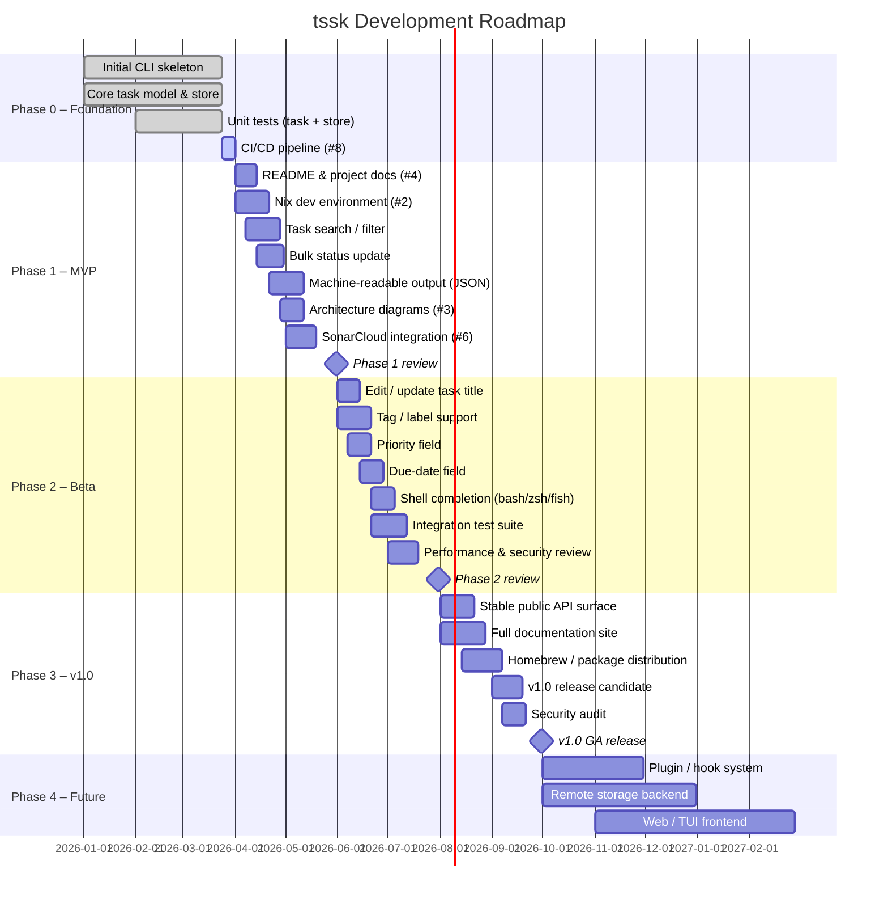
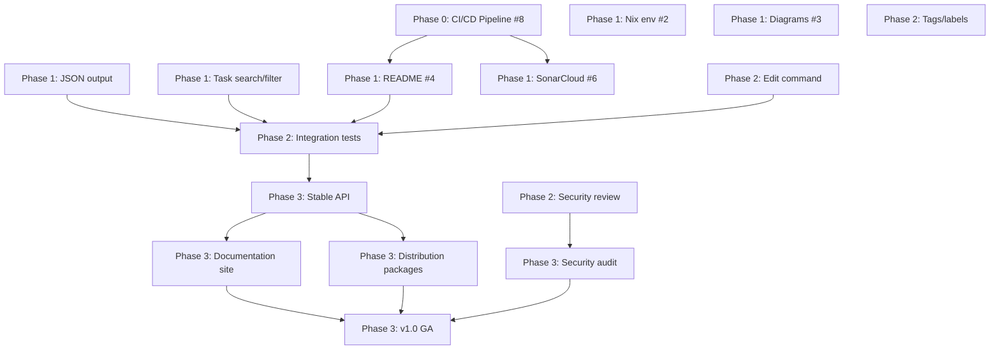

# tssk Development Roadmap

## Table of Contents

1. [Project Overview](#project-overview)
2. [Visual Timeline](#visual-timeline)
3. [Phase Breakdown](#phase-breakdown)
   - [Phase 0 – Foundation (current)](#phase-0--foundation-current)
   - [Phase 1 – MVP (2026-04-01 → 2026-05-31)](#phase-1--mvp-2026-04-01--2026-05-31)
   - [Phase 2 – Beta (2026-06-01 → 2026-07-31)](#phase-2--beta-2026-06-01--2026-07-31)
   - [Phase 3 – v1.0 (2026-08-01 → 2026-09-30)](#phase-3--v10-2026-08-01--2026-09-30)
   - [Phase 4 – Future / Post-v1.0 (2026-10-01+)](#phase-4--future--post-v10-2026-10-01)
4. [Feature Prioritisation](#feature-prioritisation)
5. [Dependencies Map](#dependencies-map)
6. [Risk Register](#risk-register)
7. [Resource Requirements](#resource-requirements)
8. [Milestone Tracking Template](#milestone-tracking-template)
9. [Roadmap Review Schedule](#roadmap-review-schedule)

## Project Overview

**tssk** is a lightweight, file-based task manager designed for both human developers and AI coding agents working inside a git repository. Tasks are stored in a `tasks.jsonl` JSONL file and full detail text is kept in content-addressed Markdown files under `docs/`. The CLI (built with [Cobra](https://github.com/spf13/cobra)) supports adding, listing, showing, updating, and linking dependent tasks.

**Goals**
- Provide a frictionless, git-friendly task tracking workflow that lives entirely in the repository.
- Enable AI agents to create, update, and query tasks programmatically.
- Remain simple enough to be used with no configuration.

**Scope**
- Single-binary Go CLI.
- Storage backend: flat JSONL file + content-addressed Markdown detail files.
- No external database or network service required for core operation.

## Visual Timeline

## Phase Breakdown

### Phase 0 – Foundation (current)

**Status:** In progress  

This phase covers the work already committed to the repository plus the items needed to stabilise the foundation before feature development begins.

| Task | Issue | Status | Due |
|------|-------|--------|-----|
| Core task model (`internal/task`) | – | ✅ Done | – |
| JSONL store (`internal/store`) | – | ✅ Done | – |
| Cobra CLI skeleton (add / list / show / status / deps) | – | ✅ Done | – |
| Unit tests for task & store packages | – | ✅ Done | – |
| Enhanced CI/CD pipeline (security scanning, quality gates) | [#8](../../issues/8) | 🔄 Active | 2026-04-01 |

**Success criteria**
- All existing tests pass on every commit via CI.
- Automated security scanning runs on each pull request.

### Phase 1 – MVP

**Goal:** A polished, documented, and discoverable MVP suitable for daily use by individual developers and small AI-agent workflows.

| Task | Issue | Priority | Estimated effort |
|------|-------|----------|-----------------|
| Update README with usage examples and architecture overview | [#4](../../issues/4) | High | 2 days |
| Add Nix development environment flake | [#2](../../issues/2) | Medium | 3 days |
| Task search / filter (`tssk list --status`, `--title`) | – | High | 4 days |
| Bulk status update (`tssk status --all`) | – | Medium | 2 days |
| Machine-readable JSON output (`--json` flag on all commands) | – | High | 3 days |
| Architecture / data-flow diagrams | [#3](../../issues/3) | Medium | 3 days |
| SonarCloud static analysis integration | [#6](../../issues/6) | Medium | 2 days |

**Technical milestones**
- `tssk list` supports `--status`, `--title` filter flags.
- All commands support `--json` for scripting/agent consumption.
- README includes a quick-start guide, command reference, and data format description.

**Dependencies**
- Phase 0 CI pipeline must be complete before SonarCloud can be integrated.
- Architecture diagrams depend on stable core design (Phase 0).

**Success metrics**
- Zero open P0/P1 bugs.
- `tssk --help` and per-command help text cover all flags.
- README score ≥ 8/10 (peer review checklist).

### Phase 2 – Beta

**Goal:** Expand the feature set to cover richer metadata, improve developer experience, and harden quality via integration tests.

| Task | Priority | Estimated effort |
|------|----------|-----------------|
| Edit / update task title and detail (`tssk edit`) | High | 3 days |
| Tag / label support on tasks | Medium | 4 days |
| Priority field (`low` / `medium` / `high` / `critical`) | Medium | 2 days |
| Due-date field with overdue reporting | Low | 3 days |
| Shell completion scripts (bash, zsh, fish) | Medium | 2 days |
| Integration test suite (end-to-end CLI tests) | High | 5 days |
| Performance profiling & optimisation for large task lists | Medium | 3 days |
| Security review and dependency audit | High | 3 days |

**Technical milestones**
- Integration test suite covers all commands with ≥ 80% path coverage.
- `tssk edit <id>` command implemented and tested.
- Shell completions generated and documented.

**Dependencies**
- Machine-readable JSON output (Phase 1) is a prerequisite for integration test harness design.
- Security review depends on stable feature set.

**Success metrics**
- Integration test pass rate: 100 %.
- `go test ./...` runs in < 30 s on CI.
- No high/critical CVEs in dependency tree.

**Review point:** 2026-07-31

### Phase 3 – v1.0

**Goal:** Production-ready v1.0 release with a stable public API, comprehensive documentation, and distribution packaging.

| Task | Priority | Estimated effort |
|------|----------|-----------------|
| Freeze and document public CLI API surface | High | 3 days |
| Full documentation site (MkDocs or Hugo) | High | 5 days |
| Homebrew formula / package manager distribution | Medium | 3 days |
| Release candidate testing & bug fixing | High | 7 days |
| External security audit | High | 5 days |
| v1.0 GitHub release with pre-built binaries | High | 2 days |

**Technical milestones**
- Semantic versioning (`v1.0.0`) tag published.
- Pre-built binaries for Linux (amd64/arm64), macOS (amd64/arm64), and Windows (amd64).
- All public commands and flags documented in a versioned reference.

**Dependencies**
- All Phase 2 items must be complete before the release candidate.
- Security audit must be completed and all findings addressed before GA.

**Success metrics**
- Zero open P0 bugs at GA.
- Documentation covers 100% of public commands.
- Binary size < 15 MB.
- Install-to-first-task time < 2 minutes (measured against documented quick-start).

### Phase 4 – Future / Post-v1.0

These items are aspirational and subject to revision at the v1.0 review.

| Idea | Description | Rough estimate |
|------|-------------|----------------|
| Plugin / hook system | Allow pre/post hooks on task operations for custom automation | Q4 2026 |
| Remote storage backend | Optional sync to a remote store (S3, GitHub Gist, etc.) | Q4 2026 |
| Web / TUI frontend | Terminal UI (`bubbletea`) or lightweight web UI | Q1 2027 |
| AI agent SDK | Typed Go client library for AI agents to interact with tssk | Q1 2027 |
| Multi-repo task aggregation | Aggregate tasks across multiple repositories | Q2 2027 |

## Feature Prioritisation

| Feature | Business Value | Technical Complexity | Priority |
|---------|---------------|---------------------|----------|
| Task search / filter | High | Low | P1 |
| Machine-readable JSON output | High | Low | P1 |
| Updated README / docs | High | Low | P1 |
| Edit task command | High | Low | P1 |
| Integration test suite | High | Medium | P1 |
| Tag / label support | Medium | Medium | P2 |
| Priority field | Medium | Low | P2 |
| Shell completions | Medium | Low | P2 |
| Nix dev environment | Low | Medium | P3 |
| Due-date field | Low | Low | P3 |
| Plugin / hook system | Medium | High | P4 |
| Remote storage backend | High | High | P4 |
| Web / TUI frontend | Medium | High | P4 |

## Dependencies Map

## Risk Register

| ID | Risk | Likelihood | Impact | Mitigation |
|----|------|-----------|--------|------------|
| R-1 | JSONL format becomes a performance bottleneck for large task lists | Medium | Medium | Profile at Phase 2; consider indexed or binary format for Phase 4 |
| R-2 | Breaking changes to public CLI flags disrupt AI agent integrations | Medium | High | Freeze public API at Phase 3; maintain a changelog; use semantic versioning |
| R-3 | Security vulnerabilities in Go dependencies | Low | High | Automated dependency audits in CI (Phase 0/1); regular `govulncheck` runs |
| R-4 | Scope creep delays v1.0 release | Medium | Medium | Strict phase gates and review points; defer non-critical features to Phase 4 |
| R-5 | Low adoption due to lack of documentation | High | High | Prioritise README (#4) and documentation site in Phase 1/3 |
| R-6 | Single-file JSONL store causes data loss on concurrent writes | Low | High | Atomic rename pattern already implemented; add advisory file locking in Phase 2 |
| R-7 | Build pipeline (CI/CD) is fragile or slow | Medium | Medium | Address in Phase 0 (#8); add caching and parallelism |

## Resource Requirements

| Phase | Estimated Effort | Required Skills |
|-------|-----------------|-----------------|
| Phase 0 – Foundation | 5 dev-days remaining | Go, CI/CD (GitHub Actions), shell scripting |
| Phase 1 – MVP | ~19 dev-days | Go, technical writing, Nix, Mermaid/diagrams |
| Phase 2 – Beta | ~25 dev-days | Go, testing (table-driven, integration), security tooling |
| Phase 3 – v1.0 | ~25 dev-days | Go, release engineering, static site tooling, security audit |
| Phase 4 – Future | TBD | Go, frontend/TUI, cloud storage APIs |
